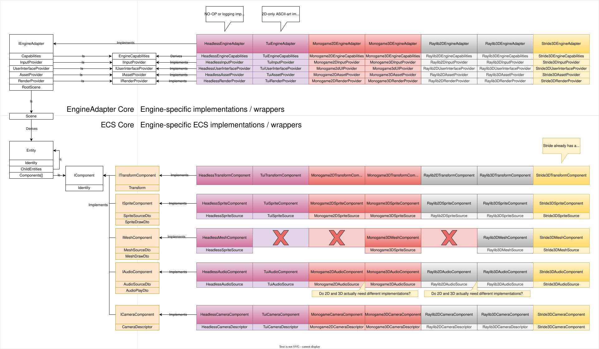

# Phase 1 — Interface development

## Overview

Phase 1 defines the stable adapter contracts and DTO shapes used by all adapters (rendering, input, audio, asset lifecycle). The goal is to produce small, well-documented C# interfaces and compact DTOs that minimize allocation and provide a stable surface for engine adapters.

## Table of contents

- [Phase 1 — Interface development](#phase-1--interface-development)
  - [Overview](#overview)
  - [Table of contents](#table-of-contents)
  - [Plan issue](#plan-issue)
  - [Plan status](#plan-status)
  - [Definition of terms](#definition-of-terms)
  - [Architectural considerations and constraints](#architectural-considerations-and-constraints)
  - [Implementation guide](#implementation-guide)
    - [Plan requirements](#plan-requirements)
    - [Phase 1 — Adapter contracts and DTOs](#phase-1--adapter-contracts-and-dtos)
      - [Objective](#objective)
      - [Technical details](#technical-details)
      - [Phase requirements](#phase-requirements)
      - [Examples](#examples)
  - [Class diagram](#class-diagram)
  - [DTO guidelines](#dto-guidelines)
  - [Testing and compatibility](#testing-and-compatibility)
  - [Performance targets](#performance-targets)
  - [Known issues and design concerns](#known-issues-and-design-concerns)
  - [See also](#see-also)
  - [References](#references)

## Plan issue

- [#2](https://github.com/JohnLudlow/GameEngineAdapter/issues/2)

## Plan status

Not started

## Definition of terms

| Term | Meaning | Reference |
| ---- | ------- | --------- |
| Adapter | An implementation binding the engine-agnostic contracts to a specific engine (MonoGame, Stride, Raylib, TUI, Headless). | |
| ContractVersion | Semantic version string indicating the adapter contract shape. | |
| DTO | Data Transfer Object — compact, typically struct-based shapes passed across the adapter boundary. | |
| EngineConfig | Configuration data supplied when initializing an adapter (engine selection, resource paths, options). | |
| FrameScope | Disposable scope returned by BeginFrame; disposing finalizes the current frame (RAII pattern). | |
| Provider | A lightweight, adapter-owned service obtained from IEngineAdapter for a specific concern (rendering, input, UI, assets). | |

## Architectural considerations and constraints

- Separation boundary: define a small, stable surface area between simulation (game logic) and engine bindings (render/input/audio/asset pipeline).
- Capability negotiation: adapters must advertise capabilities (2D, 3D, text-only, audio) so game subsystems can enable/disable optional features at runtime.
- Performance: minimize allocations and data marshaling across the adapter boundary; use structs and pooling for draw command collections.
- Platform: some adapters require native platform binaries; provide configuration to select engines and fallbacks for CI/headless.

## Implementation guide

### Plan requirements

- (***Not started***) API definitions committed with XML docs and examples.
  - GIVEN interface PR is opened
  - WHEN team reviews and approves
  - THEN interfaces are versioned and published for adapter implementations.

### Phase 1 — Adapter contracts and DTOs

***Not started***

#### Objective

Define stable adapter contracts and DTO shapes. Produce small, well-documented C# interfaces and compact DTOs that minimize allocation and provide a stable surface for engine adapters.

#### Technical details

- Define `IEngineAdapter` (lifecycle, capability descriptor, provider accessors such as `GetRenderProvider`, `GetInputProvider`).
- Define provider interfaces (`IRenderProvider`, `IInputProvider`, `IUserInterfaceProvider`, `IAssetProvider`) that expose minimal, adapter-owned runtime surfaces and DTO translation helpers.
- Providers are intentionally lightweight and adapter-owned: callers obtain a provider from the adapter and submit DTOs or poll events through that provider.
- Define `IAudioPlayer` (play/stop/volume, audio asset references) and `IAssetProvider`/`IAssetLoader` for asset lifecycle operations.
- Provide capability descriptor model (`EngineCapabilities`) returned at adapter init and allow specific engine capability variants (e.g. `HeadlessEngineCapabilities`) to derive from the base capabilities.

#### Missing type definitions

The following types are referenced by existing interfaces but do not yet have source files. They must be created in `src/GameEngineAdapter/` following the `readonly record struct` and single-file-per-type conventions.

##### EngineConfig

```csharp
/// <summary>
/// Configuration data for initializing an engine adapter.
/// </summary>
/// <param name="AdapterType">Adapter type or engine backend identifier (e.g. "MonoGame", "Stride").</param>
/// <param name="ResourcePath">Optional path to engine resources or platform binaries.</param>
/// <param name="Options">Optional key-value configuration entries.</param>
public readonly record struct EngineConfig(
    string AdapterType,
    string? ResourcePath,
    IReadOnlyDictionary<string, object>? Options);
```

##### FrameScope

```csharp
/// <summary>
/// Disposable scope for a single render frame. Disposing finalizes the frame.
/// </summary>
public readonly record struct FrameScope : IDisposable
{
    /// <summary>Finalizes the current frame.</summary>
    public void Dispose() { /* adapter-specific frame end logic */ }
}
```

##### SpriteDrawDto

```csharp
/// <summary>
/// DTO for submitting a sprite draw command.
/// </summary>
/// <param name="SpriteId">Asset identifier for the sprite texture.</param>
/// <param name="Transform">World-space transform for the sprite.</param>
/// <param name="Material">Material to apply when rendering.</param>
/// <param name="Layer">Sort layer for deterministic draw ordering.</param>
public readonly record struct SpriteDrawDto(
    string SpriteId,
    TransformDto Transform,
    MaterialDto Material,
    int Layer);
```

##### TextDrawDto

```csharp
/// <summary>
/// DTO for submitting a text draw command.
/// </summary>
/// <param name="Text">Text content to render.</param>
/// <param name="Transform">World-space transform for the text.</param>
/// <param name="FontId">Asset identifier for the font.</param>
/// <param name="FontSize">Font size in points.</param>
/// <param name="Material">Material to apply when rendering.</param>
/// <param name="Layer">Sort layer for deterministic draw ordering.</param>
public readonly record struct TextDrawDto(
    string Text,
    TransformDto Transform,
    string FontId,
    float FontSize,
    MaterialDto Material,
    int Layer);
```

##### MeshDrawDto

```csharp
/// <summary>
/// DTO for submitting a mesh draw command.
/// </summary>
/// <param name="MeshId">Asset identifier for the mesh.</param>
/// <param name="Transform">World-space transform for the mesh.</param>
/// <param name="Material">Material to apply when rendering.</param>
/// <param name="Layer">Sort layer for deterministic draw ordering.</param>
public readonly record struct MeshDrawDto(
    string MeshId,
    TransformDto Transform,
    MaterialDto Material,
    int Layer);
```

##### IInputProvider

```csharp
/// <summary>
/// Adapter-owned provider for polling input state (keyboard, mouse, gamepad).
/// </summary>
public interface IInputProvider
{
    /// <summary>Returns true if the specified key is currently pressed.</summary>
    bool IsKeyDown(string key);

    /// <summary>Returns true if the specified mouse button is currently pressed.</summary>
    bool IsMouseButtonDown(int button);

    /// <summary>Returns the current mouse position in screen coordinates.</summary>
    (float X, float Y) GetMousePosition();
}
```

##### IUserInterfaceProvider

```csharp
/// <summary>
/// Adapter-owned provider for user interface operations.
/// </summary>
public interface IUserInterfaceProvider
{
    // Members to be defined based on UI requirements.
}
```

##### IAssetProvider

```csharp
/// <summary>
/// Adapter-owned provider for asset lifecycle management (load, unload, query).
/// </summary>
public interface IAssetProvider
{
    /// <summary>Loads an asset by identifier and returns a handle.</summary>
    object LoadAsset(string assetId);

    /// <summary>Unloads a previously loaded asset.</summary>
    void UnloadAsset(string assetId);

    /// <summary>Returns true if the specified asset is currently loaded.</summary>
    bool IsAssetLoaded(string assetId);
}
```

##### IAudioPlayer

```csharp
/// <summary>
/// Interface for audio playback (play, stop, volume control).
/// </summary>
public interface IAudioPlayer
{
    /// <summary>Plays the specified audio asset.</summary>
    void Play(string audioAssetId, bool loop = false);

    /// <summary>Stops playback of the specified audio asset.</summary>
    void Stop(string audioAssetId);

    /// <summary>Sets the volume for the specified audio asset (0.0–1.0).</summary>
    void SetVolume(string audioAssetId, float volume);
}
```

##### IAssetLoader

```csharp
/// <summary>
/// Interface for async and sync asset loading, separate from the asset provider.
/// </summary>
public interface IAssetLoader
{
    /// <summary>Asynchronously loads an asset by identifier.</summary>
    Task<object> LoadAsync(string assetId, CancellationToken ct = default);

    /// <summary>Synchronously loads an asset by identifier.</summary>
    object Load(string assetId);
}
```

#### Phase requirements

- (***Not started***) Adapter lifecycle & capability negotiation
  - GIVEN adapters are present at startup
  - WHEN the game queries capabilities
  - THEN `IEngineAdapter` returns `EngineCapabilities` and exposes `Initialize`/`Shutdown` semantics and diagnostics for mismatches.

#### Examples

```csharp
/// <summary>
/// Root interface for an engine adapter.
/// </summary>
public interface IEngineAdapter : IDisposable
{
  /// <summary>Gets the advertised capabilities of the engine adapter.</summary>
  EngineCapabilities Capabilities { get; }

  /// <summary>Initializes the engine adapter with the specified configuration.</summary>
  Task InitializeAsync(EngineConfig config, CancellationToken ct = default);

  /// <summary>Shuts down the engine adapter and releases resources.</summary>
  Task ShutdownAsync(CancellationToken ct = default);

  /// <summary>Gets the provider for rendering operations.</summary>
  IRenderProvider GetRenderProvider();

  /// <summary>Gets the provider for polling input state.</summary>
  IInputProvider GetInputProvider();

  /// <summary>Gets the provider for user interface operations.</summary>
  IUserInterfaceProvider GetUserInterfaceProvider();

  /// <summary>Gets the provider for asset management.</summary>
  IAssetProvider GetAssetProvider();
}
```

```csharp
/// <summary>
/// Describes the capabilities and features supported by an engine adapter.
/// </summary>
/// <param name="Supports2D">Indicates if 2D rendering is supported.</param>
/// <param name="Supports3D">Indicates if 3D rendering is supported.</param>
/// <param name="SupportsShaders">Indicates if custom shaders are supported.</param>
/// <param name="SupportsAudio">Indicates if audio playback is supported.</param>
/// <param name="SupportsRichUI">Indicates if rich UI features are supported.</param>
/// <param name="ContractVersion">The semantic version of the adapter contract.</param>
/// <param name="SupportedTextureFormats">List of texture formats supported by the engine.</param>
/// <param name="MaxTextureSize">Maximum supported texture size in pixels.</param>
/// <param name="MaxAudioChannels">Maximum number of concurrent audio channels.</param>
public readonly record struct EngineCapabilities(
    bool Supports2D,
    bool Supports3D,
    bool SupportsShaders,
    bool SupportsAudio,
    bool SupportsRichUI,
    string ContractVersion,
    IReadOnlyList<string> SupportedTextureFormats,
    int MaxTextureSize,
    int MaxAudioChannels);

/// <summary>
/// Capabilities variant for headless or test-oriented adapters.
/// </summary>
/// <param name="Base">Base engine capabilities.</param>
/// <param name="SupportsOffscreenRendering">Indicates if offscreen rendering/capture is supported.</param>
/// <param name="DeterministicTick">Indicates if the engine supports a deterministic update tick.</param>
public readonly record struct HeadlessEngineCapabilities(
    EngineCapabilities Base,
    bool SupportsOffscreenRendering,
    bool DeterministicTick);

/// <summary>
/// Defines the type of camera projection.
/// </summary>
public enum ProjectionType { Orthographic, Perspective }

/// <summary>
/// Describes camera configuration for a render frame.
/// </summary>
/// <param name="Projection">The projection model to use.</param>
/// <param name="FieldOfViewDegrees">Field of view in degrees (for perspective projection).</param>
/// <param name="OrthographicSize">Size of the orthographic view (for orthographic projection).</param>
/// <param name="AspectRatio">Aspect ratio of the view.</param>
/// <param name="NearPlane">Distance to the near clipping plane.</param>
/// <param name="FarPlane">Distance to the far clipping plane.</param>
public readonly record struct CameraDescriptor(
    ProjectionType Projection,
    float FieldOfViewDegrees,
    float OrthographicSize,
    float AspectRatio,
    float NearPlane,
    float FarPlane);
```

```csharp
/// <summary>
/// Provider for rendering operations and submitting draw commands.
/// </summary>
public interface IRenderProvider
{
  /// <summary>
  /// Starts a new render frame with the specified camera configuration.
  /// </summary>
  /// <param name="camera">Camera configuration for the frame.</param>
  /// <returns>A scope that finalizes the frame when disposed.</returns>
  FrameScope BeginFrame(in CameraDescriptor camera);

  /// <summary>Submits a sprite for rendering.</summary>
  void SubmitSprite(in SpriteDrawDto dto);

  /// <summary>Submits text for rendering.</summary>
  void SubmitText(in TextDrawDto dto);

  /// <summary>Submits a mesh for rendering.</summary>
  void SubmitMesh(in MeshDrawDto dto);

  /// <summary>Ends the current render frame.</summary>
  void EndFrame();

  /// <summary>Presents the rendered frame to the display.</summary>
  void Present();
}
```

```csharp
/// <summary>
/// World-space transform for an object.
/// </summary>
/// <param name="X">X coordinate of the position.</param>
/// <param name="Y">Y coordinate of the position.</param>
/// <param name="Z">Z coordinate of the position.</param>
/// <param name="RotationX">Rotation around the X axis.</param>
/// <param name="RotationY">Rotation around the Y axis.</param>
/// <param name="RotationZ">Rotation around the Z axis.</param>
/// <param name="ScaleX">Scale along the X axis.</param>
/// <param name="ScaleY">Scale along the Y axis.</param>
/// <param name="ScaleZ">Scale along the Z axis.</param>
public readonly record struct TransformDto(
    float X, float Y, float Z,
    float RotationX, float RotationY, float RotationZ,
    float ScaleX, float ScaleY, float ScaleZ);

/// <summary>
/// Data transfer object for material configuration.
/// </summary>
/// <param name="ShaderId">Identifier for the shader to use.</param>
/// <param name="Uniforms">Dictionary of shader uniform values.</param>
/// <param name="TextureSlots">Indices of texture slots to bind.</param>
public readonly record struct MaterialDto(
    string ShaderId,
    IReadOnlyDictionary<string, object> Uniforms,
    IReadOnlyList<int> TextureSlots);
```

### Class diagram



### DTO guidelines

- Use compact DTOs (prefer `readonly record struct`) for draw lists to reduce GC pressure.
- Provide a small set of primitive types (Sprite, Text, Rect, MeshReference, MaterialDescriptor).
- Include an explicit `Transform` and `Layer`/`SortKey` for deterministic ordering.

### Testing and compatibility

- Unit tests: provide small translator tests that map DTOs to engine calls using fakes.
- Integration tests: use `HeadlessAdapter` and `TestAdapter` with recorded traces to verify behaviour.
- Compatibility: version `IEngineAdapter` via a `ContractVersion` in `EngineCapabilities`; adapters must detect mismatches and fail with actionable diagnostics.

### Performance targets

- Aim for single-digit microseconds per DTO translation on typical hardware for hot paths.
- Maintain allocation budgets per frame (document expected allocations for UI-heavy vs simulation-heavy ticks).

### Known issues and design concerns

- **MaterialDescriptor compile error**: `MaterialDescriptor.cs` declares a `readonly struct` but its fields (`ShaderId`, `Uniforms`, `TextureSlots`) are not marked `readonly`, causing CS8340 errors. Convert to a `readonly record struct` to match the updated convention and eliminate the manual field declarations.
- **MaterialDescriptor vs MaterialDto duplication**: Both types carry `ShaderId`, `Uniforms`/`Dictionary<string,object>`, and `TextureSlots`. Their distinct roles should be clarified — e.g. `MaterialDescriptor` as the engine-facing definition and `MaterialDto` as the cross-boundary transfer object — or they should be consolidated into a single type.
- **IAssetProvider vs IAssetLoader**: The plan references both. Clarify whether these are separate concerns (provider = lifecycle management, loader = I/O) or should be merged.

## See also

- Parent plan: [Engine Decoupling](https://github.com/JohnLudlow/FourXGame/blob/main/docs/plans/4x-game/technical/engine-decoupling/engine-decoupling.md)

## References

- Plan template: ../../templates/plan-template.md
